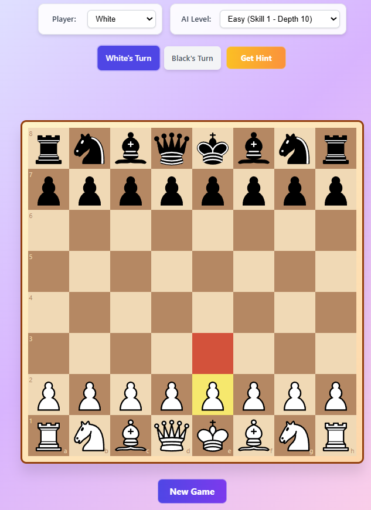

# OpenCoach - Chess Tutor

OpenCoach is a chess coach application designed to **teach while playing**. Unlike traditional chess engines, it operates as a **stateful, context-aware tutor** that reacts to board positions using a **template-driven feedback system**. The coach provides real-time guidance, helping players learn and improve through interactive gameplay.



## 🎯 Core Design Principles

### Preset Sentence Templates
The coach uses a library of pre-written feedback sentences with parameterized placeholders for:
- Piece names (`{piece}`)
- Coordinates (`{square}`)
- Tactical motifs (`{tactic}`)
- Strategic concepts (`{strategy}`)

### Contextual Triggers
Feedback is triggered by specific board states, such as:
- Blunders or inaccuracies
- Missed tactics (forks, pins, skewers)
- Positional imbalances (weak squares, bad bishop)
- Good moves (positive reinforcement)

### Real-Time Evaluation
After each move, the coach evaluates:
- Material balance
- Tactical threats
- Positional features
- Opening theory alignment (early game)

## 🗣️ Feedback System

### Feedback Categories
- **Positive Reinforcement**: Praises good moves, encourages learning
- **Constructive Critique**: Points out mistakes and suggests alternatives
- **Strategic Guidance**: Explains broader ideas like pawn structure, king safety, or piece activity
- **Tactical Alerts**: Highlights threats or missed opportunities

### Example Feedback Templates
```text
"Your {piece} on {square} is under attack—consider defending or moving it."
"Nice! That {strategy} helps control the center and frees your {piece}."
"You missed a chance to play {tactic} with {piece} on {square}."
"Try to avoid doubling your pawns unless it gives you open files or activity."
```

## 🧮 Evaluation Engine

Built on Stockfish 17 lite with:
- Depth-limited search
- Heuristic scoring
- Move classification (best, good, inaccuracy, mistake, blunder)

The engine output is mapped to feedback templates via a rule-based system:
- If `eval drop > threshold`, trigger mistake template
- If `best move matches played move`, trigger praise
- If `tactic detected`, trigger tactical advice

## 🛠️ Interaction Tools

- **Hint Button**: Triggers a soft suggestion (e.g. "Look at your knight on {square}")
- **Undo Move**: Lets users retry with guidance
- **Suggestion Arrows**: Visual overlays for recommended moves
- **Threat Arrows**: Highlights incoming dangers

## 🧪 Learning Philosophy

Rather than spoon-feeding moves, the coach:
- Encourages **active learning** by nudging rather than dictating
- Offers **explanations**, not just evaluations
- Supports **experimentation** via undo and retry

## 📱 Features

- **Mobile-First Design**: Fully responsive UI optimized for mobile devices
- **Rule-Based AI Opponent**: Non-LLM chess coach that teaches while playing
- **Client-Side Persistence**: Current session memory stored on the client's device
- **Move Navigation**: Ability to go back and review previous moves
- **Intentional Blunders**: Coach plays at an adjustable level with some intentional mistakes for learning

## 🛠 Technical Implementation

### Core Technologies
- **Frontend**: React with TypeScript and Vite
- **Chess Logic**: chess.js for game state management
- **Chess UI**: react-chessground (React wrapper for lichess chessground)
- **AI Engine**: Stockfish WASM (WebAssembly) for move evaluation and hints
- **Persistence**: Client-side storage for game sessions

### Architecture
- **Stateless Bots**: Bots receive current FEN position only
- **Functional React Patterns**: Type-safe, hook-based architecture
- **Performance Optimized**: Lite version of Stockfish for low-end hardware
- **Refactoring Friendly**: Modular design for potential React Native migration

## 🚀 Getting Started

### Prerequisites
- Node.js (v16 or higher)
- npm or yarn

### Installation
```bash
# Clone the repository
git clone <repository-url>
cd open-coach

# Install dependencies
npm install

# Start the development server
npm run dev
```

### Building for Production
```bash
# Build the application
npm run build

# Preview the production build
npm run preview
```

## 🧪 Testing

Unit tests are implemented for each component to ensure functionality and reliability.

## 📱 Mobile Accessibility

The application is designed with a mobile-first approach, ensuring:
- Touch-friendly interface
- Responsive layout for all screen sizes
- Optimized performance on low-end hardware

## 🔄 Future Enhancements

- Integration of move history for advanced features (3-fold repetition, opening books)
- React Native version using the same codebase
- Enhanced AI with opening books and endgame tablebases
- User progress tracking and learning analytics

## 📄 License

This project is licensed under the MIT License - see the LICENSE file for details.

## 🙌 Acknowledgments

- chess.js for chess logic implementation
- lichess chessground for the chessboard UI
- Stockfish for the chess engine
